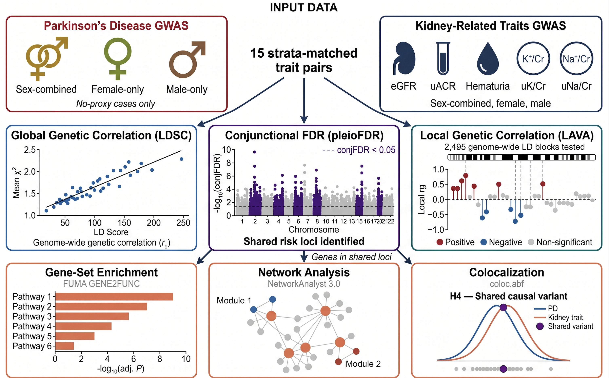

# Genome-wide cross-trait analysis of Parkinson's disease and kidney-related traits

Analysis code for the manuscript:

> **Genome-wide cross-trait analysis characterizes shared genetic architecture between Parkinson's disease and kidney-related traits**
> Le Chang\*, Sadaf Gawhary\*, Lyza Maameri, Wiame Belbellaj, Frida Lona-Durazo, Sarah A. Gagliano Taliun
> \*Equal contribution. Corresponding author: Sarah A. Gagliano Taliun (sarah.gagliano-taliun@umontreal.ca)
>

This repository contains the custom code used to characterize shared genetic
architecture between Parkinson's disease (PD) and five kidney-related traits —
estimated glomerular filtration rate (eGFR), urinary albumin-to-creatinine ratio
(uACR), hematuria, urinary potassium-to-creatinine ratio (uK/Cr), and urinary
sodium-to-creatinine ratio (uNa/Cr) — in individuals of European genetic ancestry.
All coordinates are on genome build GRCh37 (hg19).

## Study design

 
**Figure 1. Analytical workflow.** GWAS summary statistics for PD and five
kidney-related traits (eGFR, uACR, hematuria, uK/Cr, uNa/Cr), each in sex-combined,
female-only, and male-only strata, yield 15 trait pairs. Pairs are analyzed with
cross-trait LDSC (global genetic correlation), conjFDR/pleioFDR (pleiotropic loci),
and LAVA (local genetic correlation). Genes mapped to conjFDR loci are assessed for
pathway enrichment (FUMA GENE2FUNC) and PPI network enrichment (NetworkAnalyst 3.0),
and loci are evaluated by Bayesian colocalization (coloc.susie, with coloc.abf
fallback). All summary statistics are from individuals of European genetic ancestry,
aligned to GRCh37 (hg19).

